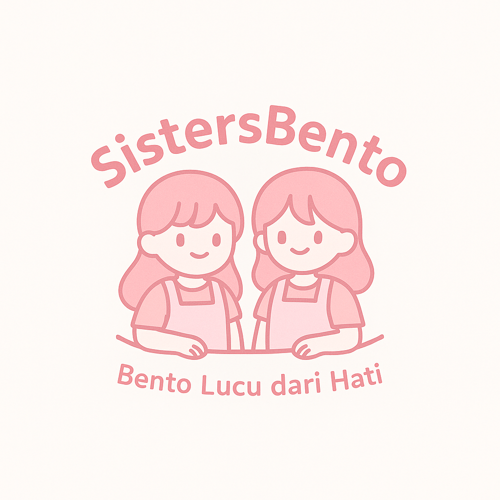
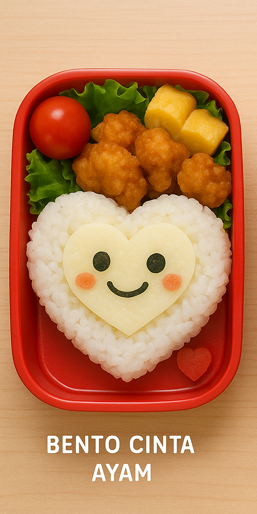
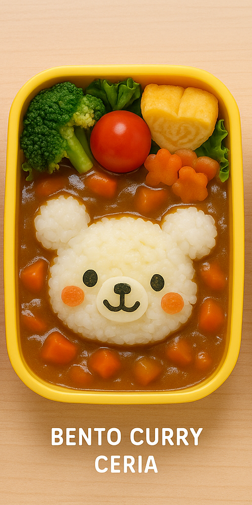
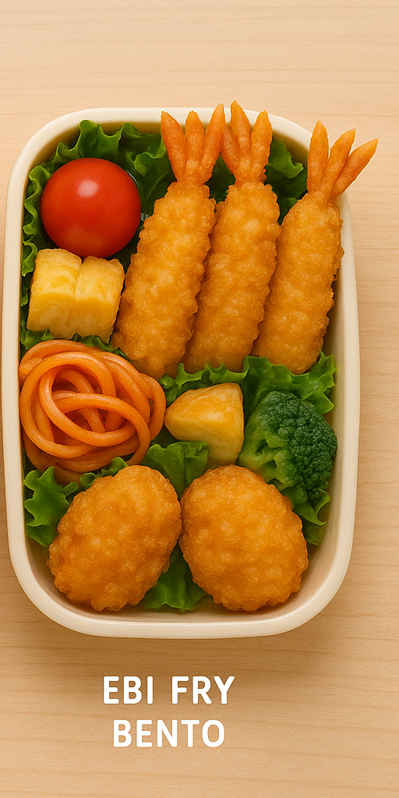

# sistersbentolandpage
<!DOCTYPE html>
<html lang="id">
<head>
  <meta charset="UTF-8">
  <meta name="viewport" content="width=device-width, initial-scale=1">
  <title>SistersBento - Bento Lucu & Lezat</title>
  
</head>
<body> 

  <header>
    
    

    <h1>🍱 SistersBento 🍱</h1>
    
💕 Cocok buat bekal, hadiah, atau makan bareng bestie!!

    <a class="btn" href="#order" onclick="document.getElementById('fairySound').play()">Pesan Sekarang</a>
  </header>

  <section>
    <h2>🎀 Dibuat dengan Cinta</h2>
    
SistersBento adalah usaha bento lucu dan lezat dari dua sahabat yang hobi masak dan suka hal-hal lucu! Kami menyajikan bento homemade yang nggak cuma enak, tapi juga bikin senyum tiap kali dibuka. SistersBento hadir dari dapur kecil kami untuk bawain senyum lewat makanan rumahan yang imut dan enak 🍓✨

  </section>

  <section>
    <h2>📦 Menu PO Minggu Ini</h2>
    
<strong>Bento Cinta Ayam</strong> – Rp.15.000

    
<strong>Bento Curry Ceria</strong> – Rp.15.000

    
<strong>Bento Ebi Fry</strong> – Rp.18.000

    <a class="btn" href="#order">🛒 Lihat Detail & Pesan</a>
  </section>

  <section>
    <h2>📸 Galeri Menu</h2>
    

      

      

      

    

    
Yuk jadi bagian dari #SistersBentoFans!

    </section>

  <section id="order">
    <h2>📆 Cara Pre-Order</h2>
    <ol>
      <li>Pilih menu favorit kamu</li>
      <li>Isi form pemesanan</li>
      <li>Transfer & konfirmasi</li>
      <li>Bento dikirim atau bisa ambil di tempat kami</li>
    </ol>
    <a class="btn" href="https://wa.me/6285752045792" target="_blank">✅ via WhatsApp</a>
    <a class="btn" href="https://www.instagram.com/sistersbento" target="_blank">🎀 Follow Instagram Kami</a>
    <h3>⏰ Waktu PO tersisa:</h3>
    

  </section>

  <section>
    <h2>💬 Testimoni Pelanggan</h2>
    
<em>"Lucu banget bento-nya, anakku sukaa! 😍"</em> — Mama Intan

    
<em>"Rasa enak, tampilan gemoy! worth it banget 🐻"</em> — Rizka, mahasiswa

  </section>

  <section>
    <h2>❓ FAQ</h2>
    
<strong>Q:</strong> Bisa COD? <strong>A:</strong> Saat ini hanya transfer terlebih dahulu.

    
<strong>Q:</strong> Bisa request karakter lucu? <strong>A:</strong> Bisa dong! Tulis request kamu di form.

    
<strong>Q:</strong> Bisa pesan buat ulang tahun? <strong>A:</strong> Boleh banget! Ada bento spesial ultah juga 🎂

  </section>

  <footer>
  
📱 Hubungi Kami:

  
WhatsApp: 0857-5204-5792

  

    <a href="https://instagram.com/SistersBento" target="_blank" style="display: inline-flex; align-items: center; color: white; text-decoration: none;">
      <svg xmlns="http://www.w3.org/2000/svg" height="20" viewBox="0 0 448 512" style="margin-right: 6px; fill: white;">
        <path d="M224.1 141c-63.6 0-114.9 51.3-114.9 114.9S160.5 370.9 224.1 370.9 339 319.6 339 255.9 287.7 141 224.1 141zm0 186.6c-39.6 0-71.7-32.1-71.7-71.7s32.1-71.7 71.7-71.7 71.7 32.1 71.7 71.7-32.1 71.7-71.7 71.7zm146.4-194.3c0 14.9-12.1 27-27 27-14.9 0-27-12.1-27-27s12.1-27 27-27 27 12.1 27 27zm76.1 27.2c-.7-15.2-4.1-28.6-12-41.1-7.9-12.5-18.2-22.8-30.7-30.7-12.5-7.9-25.9-11.3-41.1-12C328.1 32 191.9 32 126.7 32c-15.2.7-28.6 4.1-41.1 12-12.5 7.9-22.8 18.2-30.7 30.7-7.9 12.5-11.3 25.9-12 41.1C32 191.9 32 328.1 32 393.3c.7 15.2 4.1 28.6 12 41.1 7.9 12.5 18.2 22.8 30.7 30.7 12.5 7.9 25.9 11.3 41.1 12 65.2.7 201.4.7 266.6 0 15.2-.7 28.6-4.1 41.1-12 12.5-7.9 22.8-18.2 30.7-30.7 7.9-12.5 11.3-25.9 12-41.1.7-65.2.7-201.4 0-266.6zM398.8 388c-1.4 11.6-6.1 21.3-13.7 28.8-7.5 7.5-17.2 12.3-28.8 13.7-20 1.5-81.1 1.5-132.3 1.5s-112.3 0-132.3-1.5c-11.6-1.4-21.3-6.1-28.8-13.7-7.5-7.5-12.3-17.2-13.7-28.8-1.5-20-1.5-81.1-1.5-132.3s0-112.3 1.5-132.3c1.4-11.6 6.1-21.3 13.7-28.8 7.5-7.5 17.2-12.3 28.8-13.7 20-1.5 81.1-1.5 132.3-1.5s112.3 0 132.3 1.5c11.6 1.4 21.3 6.1 28.8 13.7 7.5 7.5 12.3 17.2 13.7 28.8 1.5 20 1.5 81.1 1.5 132.3s0 112.3-1.5 132.3z"/>
      </svg>
      @sistersbento
    </a>
  

  
© 2025 SistersBento

</footer>

  <audio id="fairySound" src="mixkit-fairy-glitter-867.wav" preload="auto"></audio>

  

</body>
</html>

